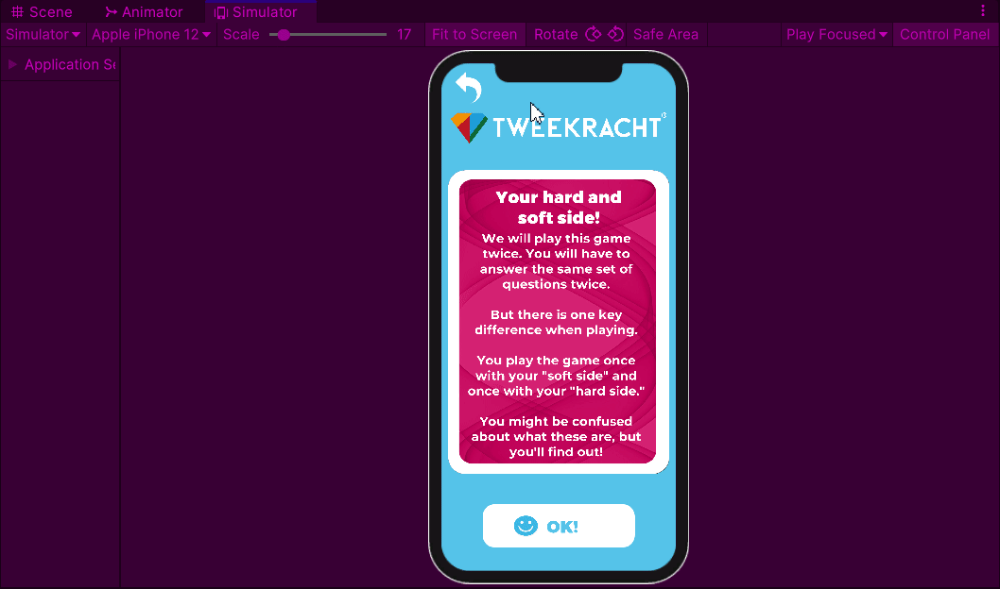

# Implementation: Hard/Soft quiz

## What is the problem?

When testing the initial digital prototype, it was found that people had trouble thinking about their hard and soft sides. I want to create a minigame that helps people understand what both these things mean and how they can think about them when playing the game.

## How did I solve this?

### <mark style="background-color:blue;">Brainstorm (Workshop)</mark>

As mentioned in [designing-implementations.md](../design-phase-improved-prototype/designing-implementations.md "mention"), I created several implementations that are supposed to solve the main issues we found with the game. This game tasks players to think more about what hard and soft emotions are. The game asks players if they've ever done a specific action or felt a specific emotion, with a small blurb of text explaining if something is hard or soft

### <mark style="color:blue;">Document analysis (Field)</mark>

Using the document in [design-principle-research.md](../design-phase-improved-prototype/design-principle-research.md "mention")I chose the following design principles to adhere to:

> Raise curiosity by interesting and unpredictable challenges

This minigame challenges the player to do some introspection and think about challenges they've overcome, emotions they've felt and things they've done.

The challenge here is finding the connection between the things asked for in the questions and their hard and soft side.

> Create clear, meaningful, and achievable goals

The minigame is explained before the game begins. As is its goal of making you think about the hard and soft side. The goals are meaningful, as it should make the rest of the game easier to play.

### <mark style="color:green;">Expert Interview (Library)</mark>

I had a small interview with Mieke about what hard and soft emotions are, as I had trouble coming up with questions.

Initially, I thought soft emotions were all emotional, therefore things like fear, sadness and passion are soft and hard emotions were all rational and expressed outward, like anger.

Mieke clarified with some examples of hard emotions.

## What is the result?

<figure><figcaption></figcaption></figure>

## How did I validate this result?

### <mark style="color:orange;">Pitch (Showroom)</mark>

I showed this implementation to Mieke and Arien, who gave me similar feedback to what was mentioned in [implementation-would-you-rather.md](implementation-would-you-rather.md "mention"). The game was a nice setup, but it still felt very much like a slideshow, instead of an actual game.

Another thing was a misunderstanding. I thought hard and soft were set in stone. Mieke clarified that while certain emotions definitely are, most actions can be interpreted differently. Something like passion, which I called soft because it's a very emotional thing, can also be hard in a way, because it's expressed outward.

### <mark style="color:purple;">A/B Testing (Lab)</mark>

This was tested, along with the physical game, during the [intermediate-test.md](intermediate-test.md "mention"). Details can be read in [intermediate-test.md](intermediate-test.md "mention")

This part of the new implementation was still the most difficult to players. This is because of the misunderstanding mentioned in [#pitch-showroom](implementation-hard-soft-quiz.md#pitch-showroom "mention"), after some explanation by me during the physical game part of the test, this became a bit easier for players.

That said, there was an improvement in understanding the goal of the game, albeit a small one compared to the understanding of the ideal world

## What is the next step?

The next step is to test this, and all the other implementations, to see if an improvement has been made.

After this, I will create more implementations, these will be tested in the end of the project to create the final project.

