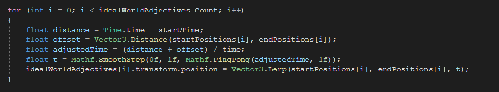
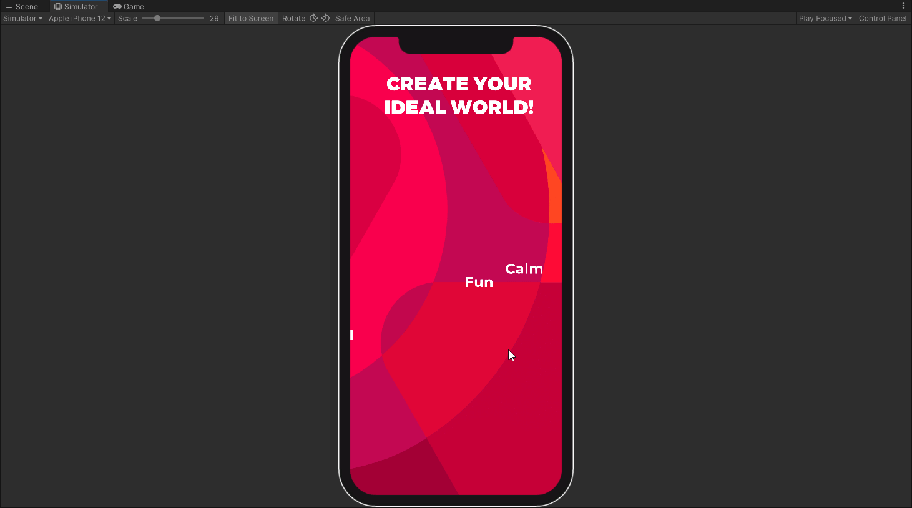

# Implementation: Ideal world creator

## What is the problem?

When testing the initial digital prototype, people had issues with thinking about the ideal world. I want to implement a game that makes them think about their own ideal world more, this is another implementation of having players think about the ideal world

## How did I solve this?

### <mark style="background-color:blue;">Brainstorm (Workshop)</mark>

As mentioned in [designing-implementations.md](../design-phase-improved-prototype/designing-implementations.md "mention"), I created several implementations that are supposed to solve the main issues we found with the game. This game tasks players to "create" their own ideal world through a set of adjectives that they want their ideal world to be.&#x20;

There is a little bit of a challenge through the way the words move, but it's not too difficult.&#x20;

I chose to go with this for the following reasons:

* Amibguity: The ambiguous nature of the adjectives on screen challenges players to really think about their ideal world
* Challenge: This also includes an actual challenge instead of just mental challenges

### <mark style="color:blue;">Document Analysis (Field)</mark>

Using the document in [design-principle-research.md](../design-phase-improved-prototype/design-principle-research.md "mention")I chose the following design principles to adhere to:

> Raise curiosity by interesting and unpredictable challenges

Like mentioned before, there is both the mental challenge as well as "physical" challenge. They aren't difficult challenges, but challenges nonetheless

> Create clear, meaningful, and achievable goals

The goal of the game is explained and this minigame exists to accomplish the goal of having people think about their ideal world, whatever that may be.

### <mark style="background-color:blue;">Prototyping (Workshop)</mark>

I made it very easy to add new words, just adding a new game object featuring the word you want to add will be enough

<figure><figcaption></figcaption></figure>

Using a combination of SmoothStep and PingPong, I make the words move up and down (or left and right) on the screen

## What is the result?

<figure><figcaption></figcaption></figure>

## How did I validate this result?

### <mark style="color:orange;">Pitch (Showroom)</mark>

I showed this implementation to Arien and Mieke. They weren't too enthusiastic about this implementation, but that's also because the presentation was still very bare bones.

### <mark style="color:purple;">A/B Testing (Lab)</mark>

I tested this, along with the rest of the implementations during the [intermediate-test.md](intermediate-test.md "mention")

