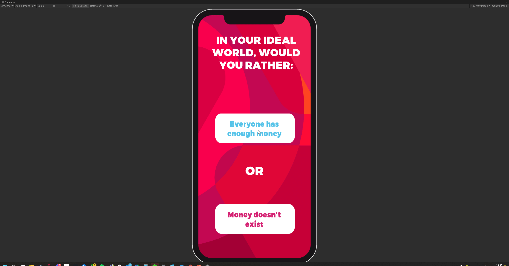

# Implementation: Would you rather?

## What is the problem?

When testing the initial digital prototype, people had issues with thinking about the ideal world. I want to implement a game that makes them think about their own ideal world more

## How did I solve this?

### <mark style="background-color:blue;">Brainstorm (Workshop)</mark>

As mentioned in [designing-implementations.md](../design-phase-improved-prototype/designing-implementations.md "mention"), I created several implementations that are supposed to solve the main issues we found with the game. This game tasks players to "create" their own ideal world in their own mind through a set of would you rather statements. I chose to go with this for a few reasons:

* Everyone's ideal world is different: This was something I found during the Talent Market, everyone's ideal world was different. Some people thought it best to think back to their childhood, others didn't, and some people would think about everyone having enough money, while others thought about a world without money at all
* The "forced choice" method is similar to the rest of the game: Much like in The Energy Game, you can't skip any of the questions, nor can you answer them at a later time. You have to answer them as you're being asked. This is to make you think about what you're answering and make sure you get a correct answer
* There are no wrong answers: Again, much like the energy game, there are no wrong answers, it's really all about how you think. Would you rather is a very subjective game

### <mark style="background-color:blue;">Prototyping (Workshop)</mark>

I created a sketch of how I wanted the game to look in Figma. This gives me a good overview of how I want the main game to look

<figure><figcaption></figcaption></figure>

Originally, I wanted to have the buttons aligned horizontally, with a picture regarding the statement at the top. However, if you look at [#what-is-the-result](implementation-would-you-rather.md#what-is-the-result "mention") it shows the buttons aligned vertically.

This was done because the statements eventually were too large to fit properly. Aligning them vertically allowed me to give them a bit more space before

### <mark style="color:blue;">Document Analysis (Field)</mark>

Using the document in [design-principle-research.md](../design-phase-improved-prototype/design-principle-research.md "mention")I chose the following design principles to adhere to:

> Raise curiosity by interesting and unpredictable challenges

Would you rather provides the players with hypotheticals, this challenges players to think about their ideal world.

An element of randomness is included to keep the minigame fresh on multiple playthroughs

> Relate to familiar activities

All the statements are written about things that are already familiar to someone (for example, whether the player would prefer having their dream car or being able to go anywhere for free with public transport)

While these scenarios are idealistic hypotheticals, people know what travelling with public transport is like, and most likely what driving a car is like. The relatability to the real world is what makes it so that these statements aren't silly and actually provide the player with the ability to form an ideal world

> Provide the status of the game process and next available actions

Before the game begins, it is explained that this minigame is to make players think about the ideal world. After the game finishes, the game will tell you what will happen next.

### <mark style="background-color:blue;">Tinkering (Workshop)</mark>

Using the existing framework, I created a setup for the Would You Rather minigame. It has a specific "Question" class that stores not only the statement but also what gets added to the summary when a choice is selected. This question class is also used in the [implementation-hard-soft-quiz.md](implementation-hard-soft-quiz.md "mention")

## What is the result?

<figure><figcaption></figcaption></figure>

Here is a full list of all would you rather questions:

IN YOUR IDEAL WORLD, WOULD YOU RATHER:

* Everyone has enough money or Money doesn't exist?
* You will always work a job you like or You don't need a job to survive?
* Own your dream car or Public transportation is free and can get you anywhere?
* Animals are safely cared for in a controlled environment (like a reservation) or Animals are free in the wild?
* Nobody eats meat or Meat is ethically lab-grown?
* Never get sick again or Medicine can cure you of any sickness?
* Live in a large house or Live in a house with a large garden?
* Always have sunny weather or always have snowy weather?
* Always experience something new Experience the things you know every day?

## How did I validate this result?

### <mark style="color:orange;">Pitch (Showroom)</mark>

I showed the implementation to Mieke and Arien, who gave me some feedback on improving the looks of the game but were happy with the concept of the game itself. They had already pre-approved all the implementation designs in [designing-implementations.md](../design-phase-improved-prototype/designing-implementations.md "mention")

### <mark style="color:purple;">A/B Testing (Lab)</mark>

This was tested, along with the physical game (and its onboarding process for comparison). Details can be read in [intermediate-test.md](intermediate-test.md "mention")

Overall, this is a step in the right direction, but there's still progress that has to be made

## What is the next step?

The next step is to test this, and all the other implementations, to see if an improvement has been made.

After this, I will create more implementations, these will be tested in the end of the project to create the final project.

